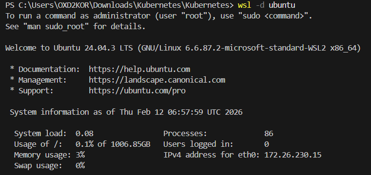

# Kubernetes

wsl -l -v

wsl -d ubuntu

# installing Kubernetes in windows system post logging into wsl -d ubuntu:

Installing Kubernetes (kubectl) on Windows using WSL (Ubuntu)
Step 1: Login to WSL Ubuntu
wsl -d ubuntu

Step 2: Update package index
sudo apt update

Step 3: Install required dependencies
sudo apt install -y apt-transport-https ca-certificates curl

Step 4: Download Kubernetes signing key
curl -fsSL https://pkgs.k8s.io/core:/stable:/v1.30/deb/Release.key | \
sudo gpg --dearmor -o /etc/apt/keyrings/kubernetes-apt-keyring.gpg

Step 5: Add Kubernetes APT repository
echo 'deb [signed-by=/etc/apt/keyrings/kubernetes-apt-keyring.gpg] https://pkgs.k8s.io/core:/stable:/v1.30/deb/ /' | \
sudo tee /etc/apt/sources.list.d/kubernetes.list

Step 6: Update packages again
sudo apt update

Step 7: Install kubectl
sudo apt install -y kubectl

Step 8: Verify installation
kubectl version --client

Step 9: Enable bash auto-completion
kubectl completion bash >> ~/.bashrc
source ~/.bashrc

